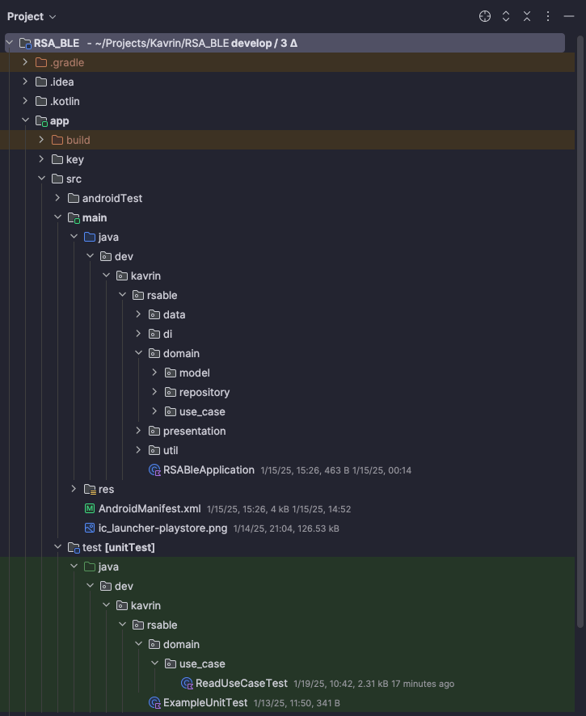
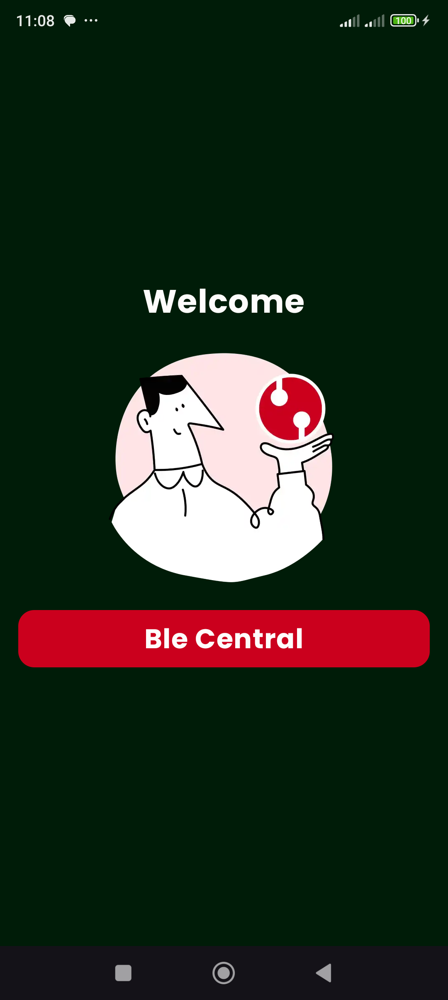
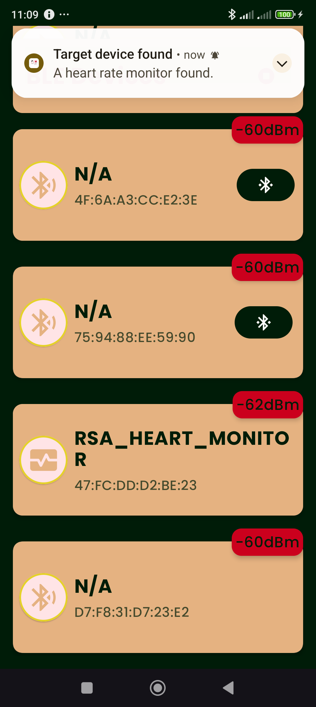
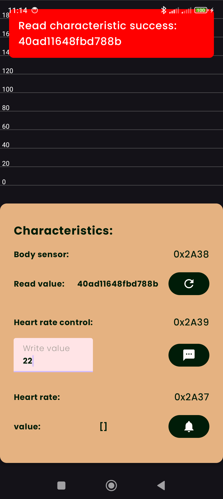
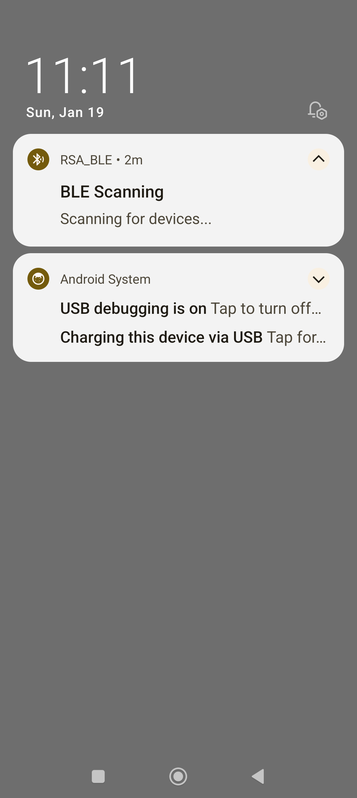
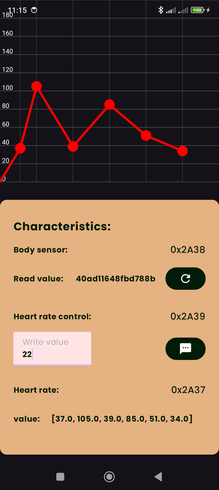

# Application Setup and Libraries Overview

## Setting Up and Running the Application

Follow the steps below to set up and run the application:

### Prerequisites

Ensure you have the following installed:

- **Android Studio**: Version Arctic Fox or later.
- **JDK**: Version 17 or later.
- **Gradle**: Comes bundled with Android Studio.

### Steps to Set Up

1. **Clone the Repository**
   ```bash
   git clone https://github.com/k4vrin/rsa_ble.git
   cd rsa_ble
   ```

2. **Open the Project**
    - Open Android Studio.
    - Select "Open an existing project" and navigate to the project directory.

3. **Sync Dependencies**
    - Once the project opens, Android Studio will prompt you to sync Gradle files. Click "Sync Now".

4. **Run the Application**
    - Connect an Android device or start an emulator.
    - Click the "Run" button or use the shortcut `Shift + F10`.

### Screenshots

Add screenshots here to illustrate the steps:

1. Screenshot of the project structure:
   

## 2. Screenshot of the app running:

| Screenshot 1                        | Screenshot 2                                        | Screenshot 3                               |
|-------------------------------------|-----------------------------------------------------|--------------------------------------------|
|              |  |               |
|  |        |  |

## 3. Heart rate monitor demo:

[demo](res/chart_demo.gif)

---

## Libraries and Tools Used

### Core Libraries

- **AndroidX Core KTX (`androidx.core:core-ktx`)**: Provides Kotlin extensions for Android framework
  APIs.
- **AndroidX Lifecycle Runtime KTX (`androidx.lifecycle:lifecycle-runtime-ktx`)**: Lifecycle-aware
  components for Android.

### UI and Navigation

- **Jetpack Compose BOM (`androidx.compose:compose-bom`)**: BOM for managing Jetpack Compose
  versions.
- **Jetpack Compose UI Toolkit**:
    - `androidx.compose.ui:ui`: Core UI framework.
    - `androidx.compose.ui:ui-tooling`: Tools for UI development.
    - `androidx.compose.material3:material3`: Material Design 3 components.
- **Jetpack Navigation Compose (`androidx.navigation:navigation-compose`)**: Navigation components
  for Compose.
- **Accompanist Permissions (`com.google.accompanist:accompanist-permissions`)**: Simplifies
  handling runtime permissions.

### Dependency Injection

- **Koin (`io.insert-koin`):**
    - `koin-core`: Core library.
    - `koin-android`: Android-specific components.
    - `koin-androidx-compose`: Integration with Jetpack Compose.

### Serialization

- **Kotlinx Serialization JSON (`org.jetbrains.kotlinx:kotlinx-serialization-json`)**: For
  serializing and deserializing JSON data.

### Testing

- **JUnit (`junit:junit`)**: Core testing framework.
- **Mockito (`org.mockito:mockito-core`)**: Mocking framework for unit tests.
- **Koin Test (`io.insert-koin:koin-test`)**: For testing Koin dependency injection.

### Other Plugins

- **KSP (`com.google.devtools.ksp`)**: Kotlin Symbol Processing for annotation processing.
- **Kotlin Serialization Plugin (`org.jetbrains.kotlin.plugin.serialization`)**: Supports Kotlin
  serialization.

---

### Notes

- Gradle plugins are managed in `libs.versions.toml` for better version control and consistency.
- Use the **Compose BOM** to ensure compatibility across Compose-related dependencies.
